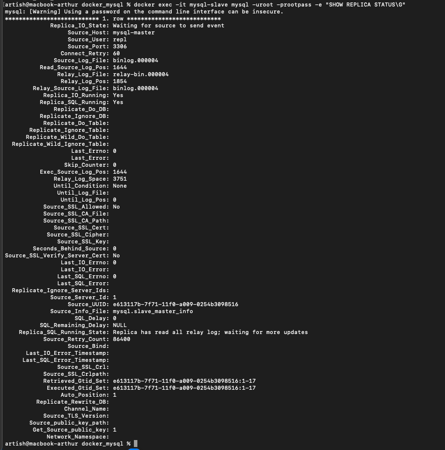

Конечно, вот готовый файл в формате Markdown, который можно скопировать целиком.

```markdown
# Домашнее задание: Репликация и масштабирование. Часть 1

---

## Задание 1 — различия master-slave и master-master

**Master-Slave**
- Один master для записи, один или несколько slave для чтения.
- Репликация односторонняя.
- Масштабирование чтения, но отказ master = остановка записи.

**Master-Master**
- Два (или больше) master: каждый умеет и читать, и писать.
- Репликация двусторонняя.
- Высокая доступность, но возможны конфликты при одновременной записи.

---

## Задание 2 — настройка master-slave

### 2.1. Конфиг master (`master.cnf`)
```ini
[mysqld]
server-id=1
log_bin=binlog
binlog_format=ROW
gtid_mode=ON
enforce_gtid_consistency=ON
binlog_expire_logs_seconds=604800
binlog_row_image=FULL
```

### 2.2. Старт master (порт 3307)
```bash
docker run -d --name mysql-master \
  -e MYSQL_ROOT_PASSWORD=rootpass \
  -p 3307:3306 \
  -v "$PWD/master.cnf":/etc/mysql/conf.d/master.cnf:ro \
  --network mysql-repl-net \
  mysql:8.0
```

### 2.3. Пользователь для репликации (на master)
```sql
docker exec -it mysql-master mysql -uroot -prootpass -e "
CREATE USER IF NOT EXISTS 'repl'@'%' IDENTIFIED BY 'replpass';
GRANT REPLICATION SLAVE, REPLICATION CLIENT ON *.* TO 'repl'@'%';
FLUSH PRIVILEGES;
SHOW MASTER STATUS\G"
```


### 2.4. Конфиг slave (`slave.cnf`)
```ini
[mysqld]
server-id=2
relay_log=relay-bin
read_only=ON
super_read_only=ON
gtid_mode=ON
enforce_gtid_consistency=ON
binlog_format=ROW
```

### 2.5. Старт slave (порт 3308)
```bash
docker run -d --name mysql-slave \
  -e MYSQL_ROOT_PASSWORD=rootpass \
  -p 3308:3306 \
  -v "$PWD/slave.cnf":/etc/mysql/conf.d/slave.cnf:ro \
  --network mysql-repl-net \
  mysql:8.0
```

### 2.6. Настройка репликации на slave
```sql
docker exec -it mysql-slave mysql -uroot -prootpass -e "
CHANGE MASTER TO
  MASTER_HOST='mysql-master',
  MASTER_USER='repl',
  MASTER_PASSWORD='replpass',
  MASTER_AUTO_POSITION=1;
START SLAVE;
SHOW SLAVE STATUS\G"
```


### 2.7. Проверка репликации
1.  **Создаем базу и таблицу на master:**
    ```sql
    docker exec -it mysql-master mysql -uroot -prootpass -e "
    CREATE DATABASE test_db;
    USE test_db;
    CREATE TABLE test_table (id INT, message VARCHAR(255));
    INSERT INTO test_table VALUES (1, 'Hello from Master!');"
    ```

2.  **Проверяем данные на slave:**
    ```sql
    docker exec -it mysql-slave mysql -uroot -prootpass -e "
    USE test_db;
    SELECT * FROM test_table;"
    ```

```
